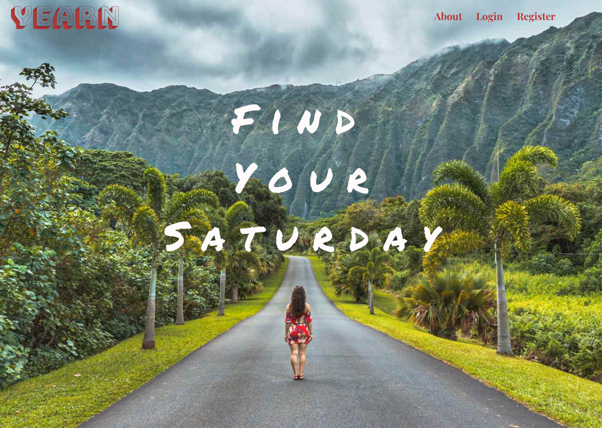
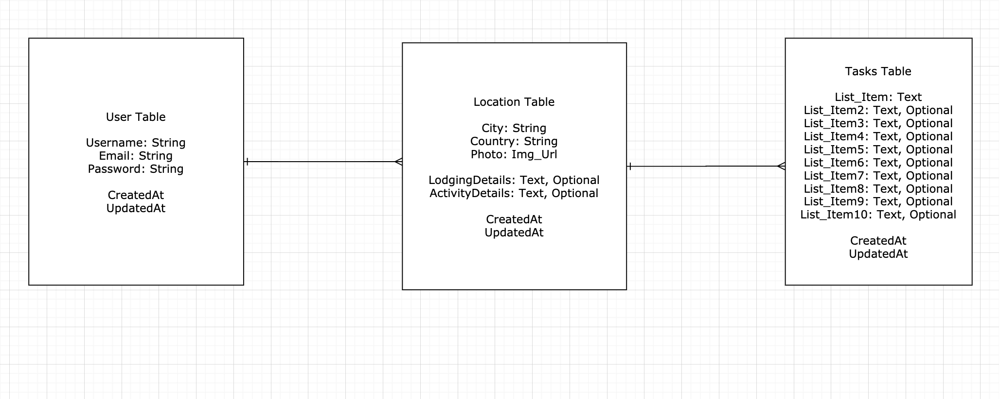

======   

**Yearn** is the ultimate digital, personal bucketlist travel app that allows you to organize your yearnings for wanterlust and motivate you to cross things off that list and **Find Your Saturday.**

It is the only to-do list that matters.

**Core Features / Goals**  
Each user has the ability to create, update or delete the locations of their desire and take this list with them to stay organized, stay motivated, and most importantly, stay wandering.

## MVP 
#### Client (Front End)
Frontend - React  
Frontend Deployment - Surge / Netlify

**WireFrame Images**   
Desktop & Tablet Renderings are the same.   
Refer to Wireframes Folder in this repository for a detailed view of each page's rendering.

**Component Heirarchy**

    src
    |__ assets/
      |__ images
    |__ Wireframes/
      |__ Wireframes.jsx
    |__ components/
      |__ Home.jsx
      |__ Header.jsx
      |__ Navigation.jsx
      |__ About.jsx
      |__ UserLanding.jsx
      |__ LocationCreate.jsx
      |__ LocationDetail.jsx
      |__ LocationEdit.jsx
      |__ Login.jsx
      |__ Register.jsx
**Component Breakdown**
Component | Type | State | Props | Description
------------ | ------------- | ------------ | ------------- | ------------ |
Home | Functional | No | No | Contains Hero text. |
Header | Functional | No | No | Contains Navigation and Logo. |
Navigation | Functional | No | No | Contains Links: About, Login, Register, Add |
About | Functional | No | No | Contains description of app. |
UserLanding | Class | No | Yes | Contains cards of specific locations.  Header personally asking user "Where to?" and addressing their name. |
LocationCreate | Class | Yes | No | Contains form to add a new location.  When done, redirects to UserLanding component. |
LocationDetail | Functional | No | Yes | Contains 3 cards of specified location and edit button. |
LocationEdit | Class | Yes | Yes | Contains form to edit specific details of location desired. |
Login | Class | Yes | No | Contains Login Form. |
Register | Class | Yes | No | Contains Register Form. |

#### Server (Back End)
Backend - Ruby on Rails  
Backend Deployment - Heroku

**ERD Model**

**Data Heirarchy** - expected endpoints from API  
/home  
/about  
/user/:id  
/user/:id/create  
/user/:id/:locationName  
/user/:id/:locationName/edit  

**Dependancies**
| Library | Purpose |
| ------------ | ------------ |
React | Render Front End |
React Router | Render Front End |
CORS | Render Front End |

## Post MVP
Once MVP is complete future features that would benefit this app and take it to the next level include but not limited to:

- [ ] Comment Model
- [ ] Packing List Model
- [ ] Tags Model for specific locations  
  E.g. Action, Experience, Food Tour, Water, Wind, Earth, Mountain, Relax, Solo, Friends, etc.
- [ ] Search Bar to see locations, other users, or tags
- [ ] Randomizer button link in Navigation Bar to display random location of another user & their bucketlist for that location for inspiration.  User's information will not be displayed; only location and bucketlist will be displayed  

**To make the app more social:**
- [ ] Give users the ability to post photos of their Saturday
- [ ] Give users the ability to browse photos of other users' Saturday
- [ ] The functionality to contact other users via direct message
- [ ] The functionality to comment on other users' Saturday or bucketlist item/location

